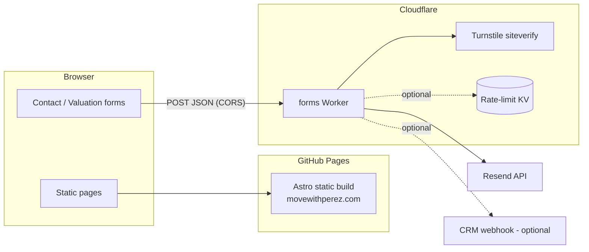

# movewithperez.com — public code snapshot

**Redacted source code for [movewithperez.com](https://movewithperez.com)** — a hyperlocal real-estate guide for southern Queens, built as a decision-support tool, not a listings portal.


## Read this first

| | |
|---|---|
| **Live site** | **[movewithperez.com](https://movewithperez.com)** — the only intended public deployment |
| **This repository** | **Code portfolio only.** Browse the engineering on GitHub; there is no hosted demo and no GitHub Pages deployment from this repo |
| **Source of truth** | A private repository with authored content, real brand assets, and production secrets |
| **Updates** | Regenerated from that private source with **fresh history** on every publish — no private commits exist here |

If you are evaluating the implementation, clone this repo and run it locally (`pnpm install`, `pnpm --filter frontend dev`). Do not expect a public URL for this mirror.

---

## Table of contents

- [What this is](#what-this-is)
- [What's redacted](#whats-redacted)
- [Architecture](#architecture)
- [Tech stack](#tech-stack)
- [Repository layout](#repository-layout)
- [Pages](#pages)
- [Content model](#content-model)
- [Forms & the Worker](#forms--the-worker)
- [Local development](#local-development)
- [Environment variables](#environment-variables)
- [Testing](#testing)
- [Production deployment](#production-deployment)
- [Accessibility](#accessibility)
- [Legal & compliance](#legal--compliance)
- [License](#license)

---

## What this is

Most agent websites are listings portals — a search box bolted onto an MLS feed, surrounded by stock photography and vanity statistics. **movewithperez.com** is deliberately **not** that.

It's a **guide and decision-support reference** for Richmond Hill, Woodhaven, Glendale, Howard Beach, and Ozone Park. The core use case is a client who can't decide between two neighborhoods: they read the guides, write down questions, and come back with sharper ones.

Product decisions visible in the code:

- **Honest, hyperlocal content** over breadth — guides name trade-offs (train noise, flood zones, tight parking).
- **Design-led** presentation.
- **No IDX/MLS listings search** (deferred).
- **Calm lead capture** — contact + valuation forms, no pop-ups or content gates.

The **authored guide prose** on the live site is **not** included here; see [What's redacted](#whats-redacted).

---

## What's redacted

- **Authored content** — real neighborhood guides and articles → schema-valid lorem stubs (`ozone-park.mdx` is the fuller template sample).
- **Brand assets** — brokerage trademarks and agent portraits → generated placeholders at the original paths/dimensions.
- **Contact details & account identifiers** in code — email, phone, license number, Worker URLs, KV ids → placeholders.
- **Deployment config** — production runbook, `CNAME`, and CI workflows.

Everything else — Astro 6 + Tailwind v4, content-collection schemas, React form islands, the Cloudflare Worker (CORS, honeypot, Turnstile, Resend, optional CRM + KV rate limit), Playwright suites, and Worker unit tests — is the real code.

---

## Architecture



**Frontend** — Astro `output: 'static'`, hosted on GitHub Pages at **movewithperez.com**.

**Worker** — Cloudflare Worker for form POSTs (`contact` | `valuation`): CORS, honeypot, Turnstile verify, validation, Resend (`reply_to` = lead), optional CRM webhook and KV rate limit.

Form logic lives in the Worker because GitHub Pages is static-only (no Astro SSR API routes).

---

## Tech stack

| Layer | Choice |
|---|---|
| Framework | **Astro 6** (`output: 'static'`) |
| Styling | **Tailwind CSS v4** |
| Content | **MDX** + Astro Content Collections |
| Interactivity | **React** islands (forms, maps) |
| Maps | **MapLibre GL** + **OpenFreeMap** |
| Form backend | **Cloudflare Workers** + **Resend** + **Turnstile** |
| Testing | **Playwright**, Worker unit tests |
| Tooling | **pnpm workspaces** |
| Production hosting | **GitHub Pages** + **Cloudflare** |

---

## Repository layout

```
├── frontend/          # Astro static site
├── worker/            # Cloudflare form backend
├── pnpm-workspace.yaml
└── package.json
```

See `frontend/src/content.config.ts` for collection schemas and `frontend/src/config.ts` for site constants.

---

## Pages

| Route | Purpose |
|---|---|
| `/` | Home — route picker, featured neighborhoods |
| `/about` | Bio |
| `/neighborhoods`, `/neighborhoods/[slug]` | Guide hub + template |
| `/buyers`, `/sellers`, `/renters` | Audience paths |
| `/insights`, `/insights/[slug]` | Articles (MDX) |
| `/contact` | Contact form |
| `/legal/*` | Privacy, terms, accessibility, fair housing, SOP |

---

## Content model

**Neighborhood guides** — `frontend/src/content/neighborhoods/<slug>.mdx`  
Required: `name`, `summary`, `heroImage`, `heroAlt`, `lat`, `lng`, `publishedAt`.

**Insights** — `frontend/src/content/insights/<slug>.mdx`  
`draft: true` hides from routing.

---

## Forms & the Worker

React islands POST JSON to `PUBLIC_FORM_ENDPOINT`. Worker flow: CORS → honeypot → Turnstile → validate → Resend → optional CRM → optional rate limit.

Turnstile uses explicit rendering (`api.js?render=explicit`) for Astro client-side navigation.

---

## Local development

```bash
pnpm install
pnpm --filter frontend dev
```

Forms need `PUBLIC_FORM_ENDPOINT` (deployed or `wrangler dev` Worker) and `PUBLIC_TURNSTILE_SITEKEY` (use Turnstile's always-pass test key `1x00000000000000000000AA` locally).

```bash
cd worker && wrangler dev
```

---

## Environment variables

**Frontend (build-time):** `PUBLIC_FORM_ENDPOINT`, `PUBLIC_TURNSTILE_SITEKEY`

**Worker (secrets):** `RESEND_API_KEY`, `TURNSTILE_SECRET_KEY`, `FROM_EMAIL`, `TO_EMAIL`, `ALLOWED_ORIGIN` / `ALLOWED_ORIGINS`, optional `CRM_WEBHOOK_URL`, `RATE_LIMIT_KV` binding.

---

## Testing

```bash
pnpm build
pnpm a11y
pnpm test:forms
pnpm worker:test
```

---

## Production deployment

**Not from this repository.** The live site at **movewithperez.com** deploys from a private repo:

- Astro build → GitHub Pages (custom domain via `frontend/public/CNAME`)
- Worker → `wrangler deploy` with production secrets and a matched Turnstile key pair

This public snapshot exists so recruiters, collaborators, and curious engineers can read the code — not to host a second copy of the site.

---

## Accessibility

WCAG 2.1 Level AA target; Playwright + axe in CI on the private repo; accessibility statement at `/legal/accessibility`.

---

## Legal & compliance

Licensed real-estate site pattern: Fair Housing, NYS notice, SOP link, privacy/terms, license disclosure. Guides use objective factors only — no steering.

Brokerage trademarks and authored content are excluded from this snapshot. See `NOTICE`.

---

## License

Code is **MIT** (`LICENSE`). See `NOTICE` for exclusions.
